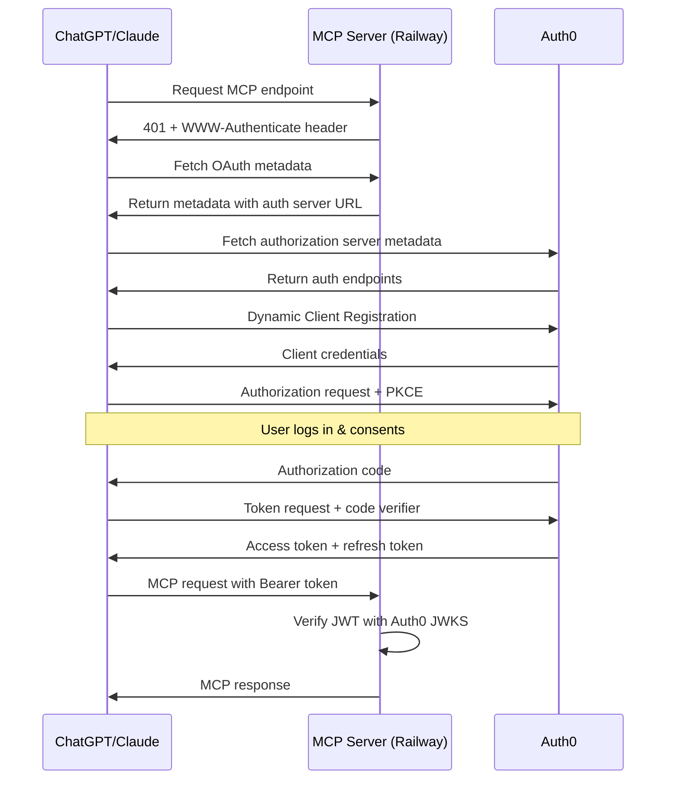

# Remote MCP Server Setup Guide with OAuth Authentication

This guide walks you through setting up a remote MCP (Model Context Protocol) server with OAuth 2.1 authentication using Auth0, deployed on Railway.

## Prerequisites

- GitHub account
- Railway account
- Auth0 account (free tier works)
- Python 3.13+ installed locally
- `uv` package manager installed

## Architecture Overview

```
ChatGPT/Claude → OAuth (Auth0) → Remote MCP Server (Railway) → YouTube API
```

- **Auth0**: Handles OAuth 2.1 authentication with Dynamic Client Registration
- **Railway**: Hosts the MCP server publicly accessible via HTTPS
- **FastMCP**: Python framework for building MCP servers with built-in OAuth support

---

## Part 1: Initial Project Setup

### 1.1 Clone and Install Dependencies

```bash
# Clone your repository
git clone <your-repo-url>
cd yt-mcp-remote

# Install dependencies using uv
uv sync

# Verify Python version
python --version  # Should be 3.13 or higher
```

### 1.2 Project Structure

```
yt-mcp-remote/
├── main.py                      # Main server file with FastMCP
├── utils/
│   └── auth.py                  # Auth0 token verifier
├── prompts/
│   ├── server_instructions.md   # MCP server instructions
│   └── *.md                     # Tool instruction templates
├── pyproject.toml               # Python dependencies
├── .env                         # Local environment variables (DO NOT COMMIT)
└── .env.example                 # Example environment file
```

---

## Part 2: Railway Deployment Setup

### 2.1 Create Railway Project

1. Go to [Railway](https://railway.app)
2. Click "New Project"
3. Select "Deploy from GitHub repo"
4. Connect your GitHub account and select your repository
5. Railway will auto-detect Python and deploy

### 2.2 Get Your Railway URL

After deployment:
1. Go to your Railway project
2. Click on your service
3. Go to "Settings" → "Networking"
4. Click "Generate Domain"
5. Copy the generated URL (e.g., `https://yt-mcp-remote-production.up.railway.app`)

**Important**: Your full MCP endpoint will be: `https://<your-railway-domain>/mcp`

---

## Part 3: Auth0 Configuration

### 3.1 Create Auth0 Tenant (First Time Setup)

If this is your first time using Auth0 or you want a dedicated tenant for this project:

1. Log in to [Auth0 Dashboard](https://manage.auth0.com)
2. Click on your tenant name in the top-left corner
3. Click **"Create tenant"**
4. Configure your new tenant:
   - **Tenant Domain**: Choose a unique subdomain (e.g., `my-mcp-server`)
     - This will become: `my-mcp-server.us.auth0.com` or `my-mcp-server.eu.auth0.com`
   - **Region**: Select closest to your users (US, EU, AU, JP)
   - **Environment**: Choose "Development" for testing, "Production" for live use
5. Click **"Create"**

**Why create a separate tenant?**
- Isolates MCP server authentication from other projects
- Allows different security policies
- Easier to manage and troubleshoot
- Free tier allows multiple tenants

**Note**: If you're using an existing tenant, skip this step and proceed to creating the API.

### 3.2 Create Auth0 API

1. In your Auth0 tenant, go to **Applications → APIs**
2. Click **"Create API"**

Configure the API:
- **Name**: `YouTube MCP Server` (or any descriptive name)
- **Identifier**: `https://<your-railway-domain>/mcp`
  - ⚠️ **CRITICAL**: Must include `/mcp` path
  - Example: `https://yt-mcp-remote-production.up.railway.app/mcp`
  - This becomes your `AUTH0_AUDIENCE`
- **Signing Algorithm**: `RS256`

Click **"Create"**

### 3.2 Configure API Settings

In your newly created API:

#### Enable RBAC and Permissions in Token
1. Go to **Settings** tab
2. Scroll to **RBAC Settings**
3. Enable: ✅ **"Enable RBAC"**
4. Enable: ✅ **"Add Permissions in the Access Token"**
5. Click **"Save"**

#### Enable Offline Access
1. Still in **Settings** tab
2. Scroll to **Access Settings**
3. Enable: ✅ **"Allow Offline Access"**
   - This allows refresh tokens for `offline_access` scope
4. Click **"Save"**

### 3.3 Configure Tenant Settings (Default Audience)

This is crucial for ChatGPT compatibility:

1. Go to **Settings** (in the left sidebar, under tenant settings)
2. Scroll to **API Authorization Settings**
3. Find **"Default Audience"**
4. Set it to: `https://<your-railway-domain>/mcp`
   - ⚠️ Must match your API Identifier exactly
5. Click **"Save Changes"**

**Why this is needed**: ChatGPT validates that token audience matches the resource advertised in metadata. Setting a default audience ensures tokens are always issued with the correct audience.

### 3.4 Enable Dynamic Client Registration

1. In Auth0 Dashboard, go to **Applications → Applications**
2. Find **"Machine to Machine Applications"**
3. Look for one that has access to "Auth0 Management API"
4. Go to its **Settings** → **Advanced Settings** → **Grant Types**
5. Ensure these are enabled:
   - ✅ Authorization Code
   - ✅ Refresh Token
   - ✅ Client Credentials

Alternatively, Dynamic Client Registration is enabled by default for APIs in Auth0.

### 3.5 Configure Database Connection

1. Go to **Authentication → Database**
2. Ensure **"Username-Password-Authentication"** exists
3. Click on it → **Applications** tab
4. Enable it for "All Applications" or specifically for your API

---

## Part 4: Environment Configuration

### 4.1 Get Auth0 Credentials

From your Auth0 Dashboard:
1. Go to **Applications → APIs → Your API**
2. Note your **Domain** (e.g., `dev-x1k2ea1lh5dffa3a.us.auth0.com`)
3. Your **Identifier** is your audience (e.g., `https://<railway-domain>/mcp`)

### 4.2 Create Local `.env` File

Create `.env` in your project root:

```bash
# Auth0 Configuration
AUTH0_DOMAIN=your-tenant.auth0.com
AUTH0_AUDIENCE=https://your-railway-domain.app/mcp
RESOURCE_SERVER_URL=https://your-railway-domain.app/mcp

# Optional: Signing algorithms (default: RS256)
AUTH0_ALGORITHMS=RS256
```

**Example**:
```bash
AUTH0_DOMAIN=dev-x1k2ea1lh5dffa3a.us.auth0.com
AUTH0_AUDIENCE=https://yt-mcp-remote-production.up.railway.app/mcp
RESOURCE_SERVER_URL=https://yt-mcp-remote-production.up.railway.app/mcp
```

### 4.3 Configure Railway Environment Variables

1. Go to your Railway project
2. Click on your service
3. Go to **Variables** tab
4. Add the same variables:
   - `AUTH0_DOMAIN`
   - `AUTH0_AUDIENCE`
   - `RESOURCE_SERVER_URL`

Click **"Add"** for each, then Railway will automatically redeploy.

---

## Part 5: Code Configuration

### 5.1 Main Server Configuration (`main.py`)

Key configuration in `main.py`:

```python
mcp = FastMCP(
    "yt-mcp",
    host="0.0.0.0",
    port=8000,
    streamable_http_path="/mcp",
    token_verifier=token_verifier,
    auth=AuthSettings(
        issuer_url=AnyHttpUrl(f"https://{auth0_domain}/"),
        resource_server_url=AnyHttpUrl(resource_server_url),
        required_scopes=["openid", "profile", "email", "address", "phone", "offline_access"],
    ),
)
```

**Important points**:
- `streamable_http_path="/mcp"` - MCP endpoint path
- `required_scopes` - Must match the OIDC scopes Auth0 grants
- Setting `required_scopes` makes FastMCP advertise `scopes_supported` in OAuth metadata

### 5.2 Custom Root Metadata Route

For ChatGPT compatibility, add a custom route at the root `.well-known` path:

```python
@mcp.custom_route("/.well-known/oauth-protected-resource", methods=["GET"])
async def oauth_metadata_root(request: Request):
    return JSONResponse({
        "resource": resource_server_url,
        "authorization_servers": [f"https://{auth0_domain}/"],
        "bearer_methods_supported": ["header"],
        "scopes_supported": ["openid", "profile", "email", "address", "phone", "offline_access"]
    })
```

**Why**: Some MCP clients check the root path before the RFC 9728 path-based endpoint.

---

## Part 6: Deploy and Test

### 6.1 Deploy to Railway

```bash
# Commit your changes
git add .
git commit -m "Configure OAuth with Auth0"
git push origin main
```

Railway will automatically detect the push and redeploy.

### 6.2 Verify OAuth Metadata Endpoints

Test that OAuth metadata is accessible:

```bash
# Test RFC 9728 path-based endpoint (used by ChatGPT)
curl https://<your-railway-domain>/.well-known/oauth-protected-resource/mcp | jq

# Test root endpoint (compatibility)
curl https://<your-railway-domain>/.well-known/oauth-protected-resource | jq

# Test MCP endpoint returns 401 with WWW-Authenticate header
curl -v https://<your-railway-domain>/mcp
```

Expected responses:
1. Both metadata endpoints return JSON with `resource`, `authorization_servers`, and `scopes_supported`
2. MCP endpoint returns `401 Unauthorized` with `WWW-Authenticate` header containing `resource_metadata` parameter

### 6.3 Test Auth0 Authorization Server Discovery

```bash
# Test OAuth 2.0 Authorization Server Metadata
curl https://<your-auth0-domain>/.well-known/oauth-authorization-server | jq

# Test OpenID Connect Discovery
curl https://<your-auth0-domain>/.well-known/openid-configuration | jq
```

Both should return metadata with endpoints like `authorization_endpoint`, `token_endpoint`, and `registration_endpoint`.

---

## Part 7: Connect MCP Clients

### 7.1 Connect from ChatGPT

1. Go to [ChatGPT](https://chatgpt.com)
2. Click your profile → **Settings**
3. Go to **Features** → **MCP Connectors**
4. Click **"Create"**
5. Configure:
   - **Name**: `YouTube Transcript`
   - **Base URL**: `https://<your-railway-domain>/mcp`
   - **Authentication**: Select "OAuth"
6. Click **"Continue"**
7. ChatGPT will:
   - Dynamically register with Auth0
   - Redirect you to Auth0 for login
   - Request consent for scopes
   - Exchange authorization code for token
8. Grant consent when prompted
9. Tools should appear in ChatGPT!

### 7.2 Connect from Claude Desktop

1. Open Claude Desktop
2. Go to **Settings** → **MCP Servers**
3. Click **"Add Server"**
4. Select **"Remote Server (HTTP)"**
5. Configure:
   - **URL**: `https://<your-railway-domain>/mcp`
   - **Authentication**: OAuth 2.0
6. Click **"Connect"**
7. Follow OAuth flow (same as ChatGPT)
8. Tools appear in Claude!

---

## Part 8: Troubleshooting

### 8.1 Common Issues

#### "Not all requested permissions were granted" (ChatGPT)

**Cause**: Audience mismatch or scope configuration issue

**Solutions**:
1. Verify `AUTH0_AUDIENCE` includes `/mcp` path
2. Check Auth0 API Identifier matches `AUTH0_AUDIENCE` exactly
3. Ensure "Default Audience" is set in Auth0 tenant settings
4. Verify `required_scopes` in code matches what Auth0 grants
5. Delete and re-add MCP connection in ChatGPT to force fresh OAuth flow

#### Metadata endpoint returns 404

**Cause**: Route not registered or server not deployed

**Solutions**:
1. Check Railway logs for startup errors
2. Verify environment variables are set in Railway
3. Ensure custom route is defined before `mcp.run()`
4. Test locally first: `uv run python main.py`

#### Token verification fails (401 errors in Railway logs)

**Cause**: JWT validation failing

**Solutions**:
1. Verify `AUTH0_AUDIENCE` matches token audience claim
2. Check `AUTH0_DOMAIN` is correct (no `https://`)
3. Ensure Auth0 API uses RS256 signing
4. Check Railway logs for specific JWT error messages

#### OAuth flow completes but tools don't appear

**Cause**: MCP connection failing after OAuth

**Solutions**:
1. Check Railway logs for incoming MCP requests
2. Verify token is being sent in `Authorization` header
3. Ensure `scopes_supported` in metadata matches token scopes
4. Test with `curl` using a valid token

### 8.2 Debugging Tools

#### Check Auth0 Logs
1. Go to Auth0 Dashboard → **Monitoring** → **Logs**
2. Look for:
   - `s` (Successful login)
   - `seacft` (Authorization code exchange)
   - `sapi` (Dynamic client registration)
3. Check `details` for scope information

#### Check Railway Logs
```bash
# View real-time logs
railway logs

# Or in Railway dashboard:
# Project → Service → Deployments → View Logs
```

Look for:
- MCP endpoint requests (`POST /mcp`)
- JWT verification messages
- 401/403 errors

#### Test Token Locally

```python
# Add to utils/auth.py for debugging
async def verify_token(self, token: str) -> AccessToken | None:
    try:
        payload = decode(...)
        print(f"Token payload: {payload}")  # Debug print
        return AccessToken(...)
    except Exception as e:
        print(f"Verification error: {e}")
        return None
```

---

## Part 9: Security Considerations

### 9.1 Token Security

- ✅ Tokens are validated on every request
- ✅ RS256 signing ensures token integrity
- ✅ Audience claim prevents token misuse
- ✅ Token verification uses Auth0's JWKS endpoint
- ✅ Scope validation (if `required_scopes` enforced)

### 9.2 Best Practices

1. **Never commit `.env`** - Add to `.gitignore`
2. **Use HTTPS only** - Railway provides this automatically
3. **Rotate secrets** - Auth0 allows key rotation
4. **Monitor logs** - Check for suspicious activity
5. **Set token expiration** - Configure in Auth0 API settings
6. **Use refresh tokens** - Enable with `offline_access` scope

### 9.3 Production Checklist

- [ ] Environment variables set in Railway
- [ ] `.env` not committed to Git
- [ ] Auth0 RBAC enabled
- [ ] Default audience configured
- [ ] Offline access enabled
- [ ] Railway domain configured
- [ ] OAuth metadata endpoints return 200
- [ ] MCP endpoint returns 401 with proper headers
- [ ] Tested with both ChatGPT and Claude
- [ ] Logs show successful token verification
- [ ] Tools appear and function correctly

---

## Part 10: Architecture Deep Dive

### 10.1 OAuth 2.1 Flow



### 10.2 Metadata Discovery

MCP clients discover OAuth configuration through:

1. **Protected Resource Metadata** (RFC 9728):
   - Path-based: `/.well-known/oauth-protected-resource/mcp`
   - Root (compat): `/.well-known/oauth-protected-resource`
   - Contains: authorization server URL, resource identifier, supported scopes

2. **Authorization Server Metadata** (RFC 8414):
   - Path: `/.well-known/oauth-authorization-server`
   - Contains: endpoints, grant types, PKCE support

3. **OpenID Connect Discovery**:
   - Path: `/.well-known/openid-configuration`
   - Contains: OIDC endpoints, supported claims

### 10.3 Key Configuration Parameters

| Parameter | Purpose | Example |
|-----------|---------|---------|
| `AUTH0_DOMAIN` | Auth0 tenant domain | `dev-abc123.us.auth0.com` |
| `AUTH0_AUDIENCE` | Token validation audience | `https://app.railway.app/mcp` |
| `RESOURCE_SERVER_URL` | Resource identifier in metadata | `https://app.railway.app/mcp` |
| `required_scopes` | Scopes advertised in metadata | `["openid", "profile", ...]` |
| `streamable_http_path` | MCP endpoint path | `/mcp` |

**Critical**: `AUTH0_AUDIENCE` must match `RESOURCE_SERVER_URL` and Auth0 API Identifier

---

## Appendix: Reference Files

### A1: Complete `main.py` Structure

```python
from mcp.server.fastmcp import FastMCP
from mcp.server.auth.settings import AuthSettings
from pydantic import AnyHttpUrl
from starlette.responses import JSONResponse
from starlette.requests import Request
import os

# Load environment
auth0_domain = os.getenv("AUTH0_DOMAIN")
resource_server_url = os.getenv("RESOURCE_SERVER_URL")

# Create MCP server
mcp = FastMCP(
    "yt-mcp",
    host="0.0.0.0",
    port=8000,
    streamable_http_path="/mcp",
    token_verifier=token_verifier,
    auth=AuthSettings(
        issuer_url=AnyHttpUrl(f"https://{auth0_domain}/"),
        resource_server_url=AnyHttpUrl(resource_server_url),
        required_scopes=["openid", "profile", "email", "address", "phone", "offline_access"],
    ),
)

# Custom root metadata route for compatibility
@mcp.custom_route("/.well-known/oauth-protected-resource", methods=["GET"])
async def oauth_metadata_root(request: Request):
    return JSONResponse({
        "resource": resource_server_url,
        "authorization_servers": [f"https://{auth0_domain}/"],
        "bearer_methods_supported": ["header"],
        "scopes_supported": ["openid", "profile", "email", "address", "phone", "offline_access"]
    })

# Define MCP tools
@mcp.tool()
def your_tool(param: str) -> str:
    """Tool implementation"""
    pass

# Run server
if __name__ == "__main__":
    mcp.run(transport='streamable-http')
```

### A2: `utils/auth.py` Structure

```python
from mcp.server.auth.provider import AccessToken, TokenVerifier
from jwt import PyJWKClient, decode, InvalidTokenError
import asyncio

class Auth0TokenVerifier(TokenVerifier):
    def __init__(self, domain: str, audience: str):
        self.domain = domain
        self.audience = audience
        self.jwks_url = f"https://{domain}/.well-known/jwks.json"
        self.issuer = f"https://{domain}/"
        self.jwks_client = PyJWKClient(self.jwks_url)

    async def verify_token(self, token: str) -> AccessToken | None:
        try:
            # Get signing key
            signing_key = await asyncio.to_thread(
                self.jwks_client.get_signing_key_from_jwt, token
            )

            # Decode and verify
            payload = decode(
                token,
                signing_key.key,
                algorithms=["RS256"],
                audience=self.audience,
                issuer=self.issuer,
            )

            # Return AccessToken
            return AccessToken(
                token=token,
                client_id=payload.get("azp", "unknown"),
                scopes=payload.get("scope", "").split(),
                expires_at=payload.get("exp"),
                resource=self.audience,
            )
        except InvalidTokenError:
            return None
```

---

## Summary

You now have a fully configured remote MCP server with OAuth 2.1 authentication:

✅ **Auth0** provides secure OAuth with Dynamic Client Registration
✅ **Railway** hosts your MCP server with automatic HTTPS
✅ **FastMCP** handles MCP protocol and OAuth validation
✅ **ChatGPT & Claude** can discover and connect to your server

Your server:
- Advertises OAuth metadata per RFC 9728
- Validates JWT tokens from Auth0
- Supports Dynamic Client Registration
- Works with multiple MCP clients
- Follows OAuth 2.1 security best practices

---

**Need help?** Check the troubleshooting section or Auth0/Railway logs for detailed error messages.
